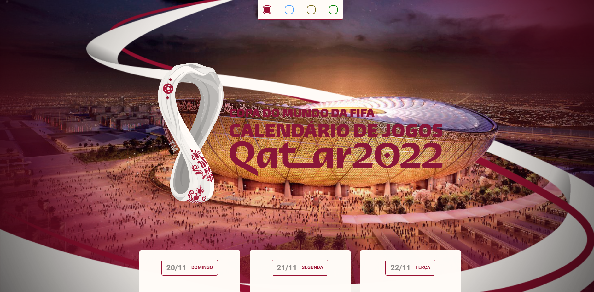

<h1 align="center">Calendário de Jogos Copa 2022</h1>

  <a href="#-tecnologias">Tecnologias</a>&nbsp;&nbsp;&nbsp;|&nbsp;&nbsp;&nbsp;
  <a href="#-projeto">Projeto</a>&nbsp;&nbsp;&nbsp;&nbsp;&nbsp;&nbsp;

 

  

## ⚙️ Tecnologias

Esse projeto foi desenvolvido com as seguintes tecnologias:

- HTML e CSS
- JavaScript e JSON
- Git e Github

## 💻 Projeto

Consiste em um simples calendário de jogos da Copa de Mundo de 2022, no Qatar, em que você pode acessar e se informar sobre os dias e horários de cada jogo e time que quiser acompanhar.
